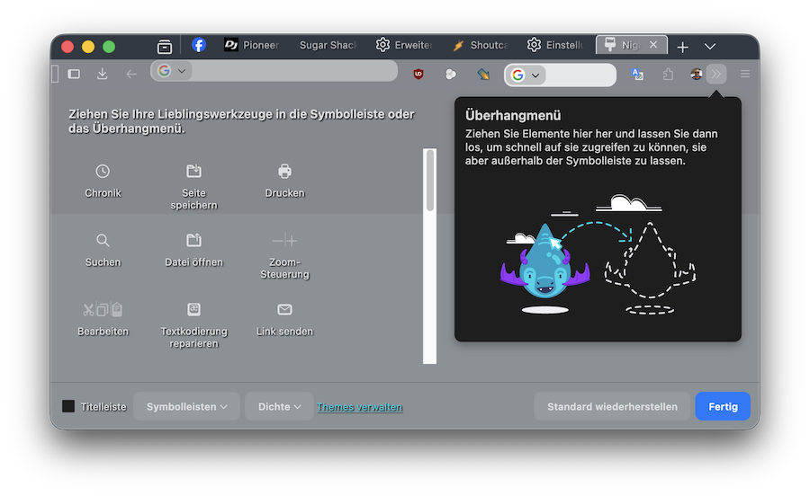

#  My Custom UI Styles for Firefox Nightly

This is the contents of my Firefox "chrome" folder, containing my own CSS customizations. I use these files on macOS.

The goal of these styles is to optimize the "compact mode“ in the Nightly. My focus was on the tab & address bar, but other customizations are also included.

I wanted to share these files because "CustomCSSforFx" is no longer up-to-date. If you like my design (see screenshot), feel free to copy it. 

#  How to use
Copy the chrome Folder to your Profile, restart Firefox.
#
Enable user stylesheets and compact mode. Copy this text into your user.js (or copy user.js in your profile):

// Enable user stylesheets

user_pref("toolkit.legacyUserProfileCustomizations.stylesheets", true);

// Enable compact mode

user_pref("browser.compactmode.show", true);

// Enable Nova UI

user_pref("browser.nova.enabled", true);

user_pref("browser.newtabpage.activity-stream.nova.enabled", true);

user_pref("browser.urlbar.nova.featureGate", true);

user_pref("browser.urlbar.quicksuggest.ampTopPickUseNovaIconSize", true);

#

# Enable Compact Mode
Go to View > Toolbars > Customize Toolbar and select Compact(at the bottom).

# Give feedback 
